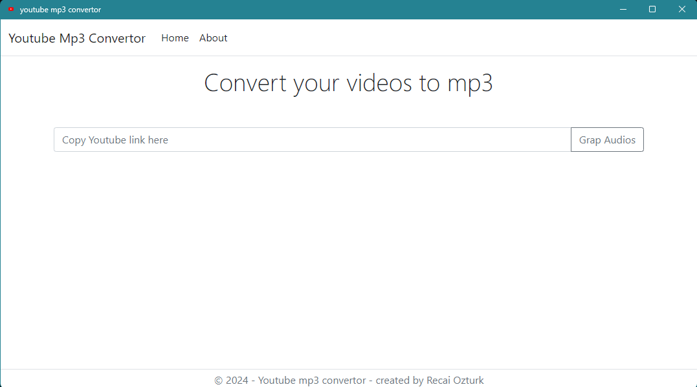
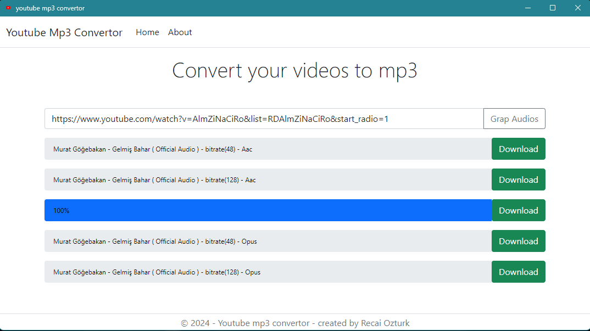

# YouTube MP3 Converter Desktop App

This project is the desktop version of a YouTube MP3 converter web application based on .NET Core MVC. It was created using the Chromely framework to run in the desktop environment, and the communication between the server and the client is supported by SignalR.

## Features 
- **Desktop Usage:** Provides a fast and efficient user experience by moving the web-based .NET Core MVC project to the desktop with Chromely.
- **YouTube MP3 Conversion:** Easily converts YouTube video links to MP3 format and downloads them to your computer.
- **Instant Updates:** Fast data transfer between server and client is achieved using SignalR.
- **Minimalist Design:** The application has a simple and user-friendly interface.

## Tech Stack 
- **NET Core 6:** For the basic infrastructure of the project.
- **Chromely:** To turn a .NET Core web application into a desktop application.
- **SignalR:** For server-client interaction and push notifications.
- **HTML, CSS, JavaScript,Bootstrap**: For interface and styling.

 [Download App](https://drive.google.com/file/d/1paOR3fFsycqYFg8fWGcgdi0BXKBhjbVd/view?usp=sharing)

## !Important Information About the First Start of the Application
This application will prepare the necessary files and directories when it is first started. Since these operations require administrator privileges, do not forget to start the application with the "Run as Administrator" option when it is first started. Otherwise, access errors may occur during file preparation operations and the application may not work properly.

Samples 
  
  

  
